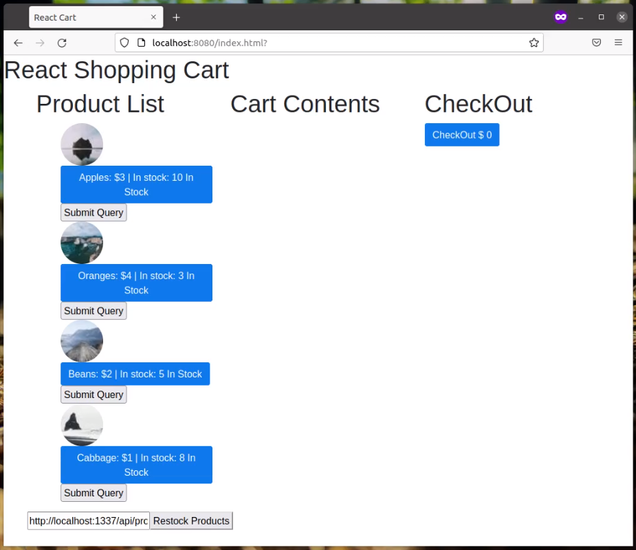

# ReactShoppingCart
REACT Shopping Cart exercise for xPro course (NOT WORKING 100%)

Description: This is an exercise in using REACT to make a simple shopping cart web page with the following features:
-Products appear on the left with prices and quantities in stock.
-The shopping cart list appears in the middle, and items inside can be clicked to show the price and clicked again to remove it.
-The running total is shown on the right side.
-A restock button sends communicates to a Strapi database and returns stock levels of the products to according to the data returned (NOT WORKING PROPERLY).
All functions are within the same browser and nothing is saved.

Usage: 
1. This example uses API calls to a local Strapi database with a collection called "Products". Strapi and the collection must be setup locally for this part to work.
2. The URL for the local API is: "http://localhost:1337/api/products" and the response body is this:
{"data":[{"id":1,"attributes":{"name":"Apples","country":"Italy","cost":3,"instock":10,"createdAt":"2022-08-10T11:52:56.443Z","updatedAt":"2022-08-10T11:53:12.266Z","publishedAt":"2022-08-10T11:53:12.263Z"}},{"id":2,"attributes":{"name":"Oranges","country":"Spain","cost":4,"instock":3,"createdAt":"2022-08-10T11:54:05.154Z","updatedAt":"2022-08-10T11:54:08.854Z","publishedAt":"2022-08-10T11:54:08.851Z"}},{"id":3,"attributes":{"name":"Beans","country":"USA","cost":2,"instock":8,"createdAt":"2022-08-10T11:55:06.286Z","updatedAt":"2022-08-10T11:55:08.850Z","publishedAt":"2022-08-10T11:55:08.847Z"}},{"id":4,"attributes":{"name":"Cabbage","country":"USA","cost":1,"instock":8,"createdAt":"2022-08-10T11:56:05.149Z","updatedAt":"2022-08-10T11:56:06.580Z","publishedAt":"2022-08-10T11:56:06.578Z"}}],"meta":{"pagination":{"page":1,"pageSize":25,"pageCount":1,"total":4}}} 
3. Download/copy the files and folders to a local folder. 
4. If using Strapi, open the command line point to the root folder of the collection above, for example "cd path/to/cartDB", then run "npm run develop" to start Strapi. 
4. If using Node.js, open the command line point to the root folder of the target files, for example "cd path/to/ReactShoppingCart". 
5. Then run "npm install" to install all dependencies, and then run "http-server ./public" to start the server. 
6. Then view the page by navigating to the following URL in a web browser: "http://127.0.0.1:8080/index.html" (default IP address and port number is shown).

The output should include the following:
-A list of products and details to the left. Product images should be random.
-The contents of the shopping cart in the middle.
-The running total to the right.
The output should look like this:
 

Roadmap: This exercise can be improved in the future by fixing the error to return restock quantities to original levels without affecting anything else. Then product grouping can be done so that identical products do not appear in the cart.

License: MIT License (NOTE: a significant amount of this code was taught and/or provided via the MIT xPRO course in Full Stack Development, and I do not claim ownership over it)

Permission is hereby granted, free of charge, to any person obtaining a copy
of this software and associated documentation files (the "Software"), to deal
in the Software without restriction, including without limitation the rights
to use, copy, modify, merge, publish, distribute, sublicense, and/or sell
copies of the Software, and to permit persons to whom the Software is
furnished to do so, subject to the following conditions:

The above copyright notice and this permission notice shall be included in all
copies or substantial portions of the Software.

THE SOFTWARE IS PROVIDED "AS IS", WITHOUT WARRANTY OF ANY KIND, EXPRESS OR
IMPLIED, INCLUDING BUT NOT LIMITED TO THE WARRANTIES OF MERCHANTABILITY,
FITNESS FOR A PARTICULAR PURPOSE AND NONINFRINGEMENT. IN NO EVENT SHALL THE
AUTHORS OR COPYRIGHT HOLDERS BE LIABLE FOR ANY CLAIM, DAMAGES OR OTHER
LIABILITY, WHETHER IN AN ACTION OF CONTRACT, TORT OR OTHERWISE, ARISING FROM,
OUT OF OR IN CONNECTION WITH THE SOFTWARE OR THE USE OR OTHER DEALINGS IN THE
SOFTWARE.
